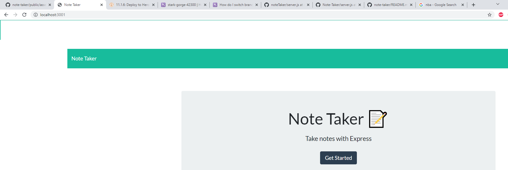
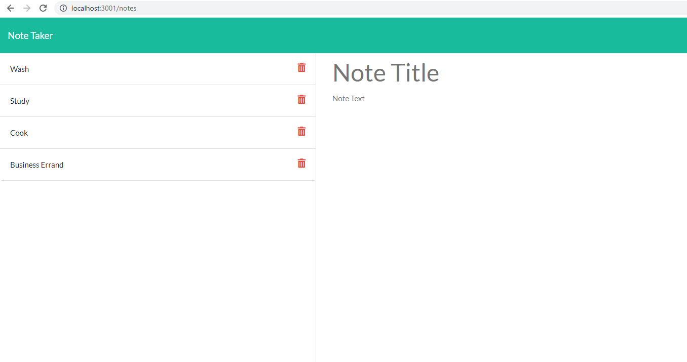

# note-taker

**Node Javascript Challenge**

**Version 1.11.0**

**Professional note-taker challenge activity.**

The aim of this project is to create an application called Note Taker that can be used to write and save notes. Users should alos be able to click on the created tasks as well as delete tasks using the garbage icon. This application will use an Express.js back end and will save and retrieve note data from a JSON file. The application’s front end has already been created. A back end must be built, connect the two, and then deploy the entire application to Heroku.

**This project follows the criteria below:**

- GIVEN a note-taking application
- WHEN I open the Note Taker
- THEN I am presented with a landing page with a link to a notes page
- WHEN I click on the link to the notes page
- THEN I am presented with a page with existing notes listed in the left-hand column, plus empty fields to enter a new note title and the note’s text in the right-hand column
- WHEN I enter a new note title and the note’s text
- THEN a Save icon appears in the navigation at the top of the page
- WHEN I click on the Save icon
- THEN the new note I have entered is saved and appears in the left-hand column with the other existing notes
- WHEN I click on an existing note in the list in the left-hand column
- THEN that note appears in the right-hand column
- WHEN I click on the Write icon in the navigation at the top of the page
- THEN I am presented with empty fields to enter a new note title and the note’s text in the right-hand column

## Built With

- Node.js
- Javascript
- HTML
- CSS (use of Bootstrap)
- Express js

## Work Completed

**A successful completion of this project includes the us of the following:**

- Application of express js
- Application of arrays
- Utilizing file system and inquirer packages
- Creating multiple variables and functions
- Utilizing file system to write files
- Installing npm packages
- Utilization of insomnia to test routes
- Deploy working app using Heroku

## Project Visual

- Showing the originial state of the app

- Showing note page

## Github pages and links

**This project has been deployed to GitHub Pages.** 

- [Github Repository](https://github.com/kenesei91/note-taker)

**Heroku deployed app**

- [Heroku app](https://stark-gorge-42300.herokuapp.com/)

## Contributors/Contact

- Kenechukwu K Ilochonwu <keneilo91@yahoo.com>

## Licence & Copyright

© Kenechukwu K Ilochonwu, Web Project Design

Licensed under the [LICENSE] (MIT LICENSE)
